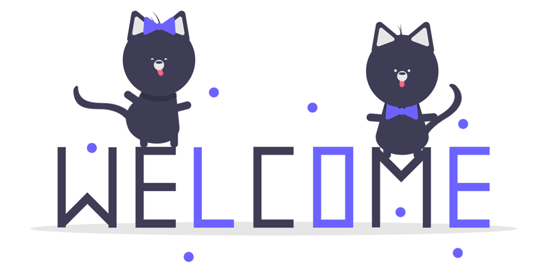

    <h1> 👋 Hi, I'm Khan Asfi Reza 👋 </h1> 
    

    

#### I am a Full-Stack Developer. Learning to code since 2015. Working as a Freelance Full-Stack Developer from 2019. Currently trying to get my hands dirty in open source development

- #### ✨ Languages: 
    ` Python `  ` TypeScript `  ` Java `  ` Kotlin `  ` CSS `  ` SQL ` `C++`
- #### 🎆 Frameworks: 
   ` Django `  ` React`  ` Svelte `  ` Express `  ` Flask `  ` Fast Api `  ` VueJs ` ` NextJS `
- #### 🎆 Tech Stacks:   
   ` Git `  ` CI/CD `  ` Unit Testing ` ` Docker ` 

### My stats

 
### Github

### Contact Me

<!---
khan-asfi-reza/khan-asfi-reza is a ✨ special ✨ repository because its `README.md` (this file) appears on your GitHub profile.
You can click the Preview link to take a look at your changes.
--->
